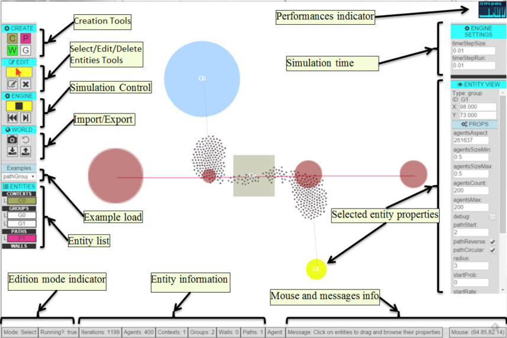

crowd-sim
=========

CrowdSim is a 2D crowd simulator implemented in JavaScript. It is implemented as a low level library (CrowdSim.js) and a low level application (CrowdSimApp.js). Both JavaScript modules are integrated into a web aplication that is located in the *demo* folder.

## Features ##
- A 2D simulator crowd simulator lib with a demo application using Pixi.js for rendering.
- Definition of areas (Contexts) types (enter, exit, passing)
- Definition of groups behaviours
- Definition of paths for groups
- Definition of walls as obstacles
- Simulation of multiples agents from different groups following different paths.
- Engine: Play, stop, step.
- GUI editor for Add/Edit/Remove Contexts, Groups, Paths, Walls
- Groups associated to start Contexts, end Contexts and a Path for new generated Agents
- World Export/Import, Snapshot and revert all properties from Contexts/Groups/Paths/Walls
- Right panel to see entities properties and manually edit them.
- Zoom and panning with middle mouse button-
- Hotkeys for show/hide details: a (Agents), g (Groups), c (Contexts), p (Paths), w (Walls)

## Tools  ##
- Pixi.js : 2D render
- Gulp : as task manager running and compiling.
- Browserify: for module packaging.
- Bower : as dependency manager

# Demo #
Select different examples from left panel "Examples" select box in:
**https://rawgit.com/Jacq/crowd-sim/master/demo/index.html**

# Screenshot #

# API Reference #
**https://rawgit.com/Jacq/crowd-sim/master/doc/index.html**

## References

### Crowd Simulators and related implementations:
- http://pedsim.silmaril.org/
- http://www.tbx.com.sg/crowdsapi/
- http://gamma.cs.unc.edu/research/crowds/
- https://github.com/makokal/crowdsim
- https://github.com/aelse/python-crowd
- http://itp.uni-frankfurt.de/~gros/JavaApplets/PedestrianCrowdDynamics/PedestrianApplet.html

### Books/papers
- "Crowd Simulation", Daniel Thalmann, Soraia Raupp, Ed. Springer2007
- "Simulatingdynamicalfeatures of escape panic", Dirk Helbing, Ille Âs Farkas & Tama Âs Vicsek, NATURE|VOL 407|28 SEPTEMBER 2000|
- "Social force model for pedestrian dynamics", Dirk Helbing, and Péter Molnár, 1995
- "Collective Information Processing and Pattern Formation in Swarms, Flocks, and Crowds", Mehdi Moussaid, Simon Garnier,Guy Theraulaz,Dirk Helbinga, Topics in Cognitive Science 1 (2009) 469–497
- "Experimental study of the behavioural mechanisms underlying self-organization in human crowds", Mehdi Moussaïd, Dirk Helbing, Simon Garnier, Anders Johansson, Maud Combe and Guy Theraulaz, Procedings of the Royal Society 2009.
- "The Walking Behaviour of Pedestrian Social Groups and Its Impact on Crowd Dynamics", Mehdi Moussaı, Niriaska Perozo, Simon Garnier, Dirk Helbing, Guy Theraulaz, PLOS One 2010 Vol 5 Issue 4
- "Modeling Individual Behaviors in Crowd Simulation", Adriana Braun, Soraia R. Musse, Luiz P. L. de Oliveira and Bardo E. J. Bodmann Av. Unisinos, 950 – São Leopoldo, RS, Brazil  http://web.cse.ohio-state.edu/~parent/classes/888/SIG07/BehavioralAnimation.pdf

### Js libs
- 2D Vec http://glmatrix.net/
- http://danieltao.com/lazy.js/

### Rendering
- http://www.pixijs.com/
- http://www.html5gamedevs.com/

### Gulp tasks (SASS, Injects, clear...)
- https://github.com/johnpapa/gulp-patterns
- http://browserify.org/
- http://www.browsersync.io/
